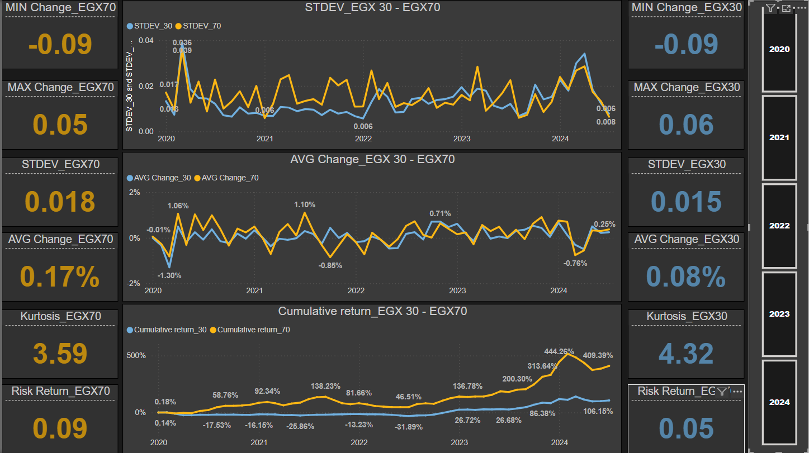
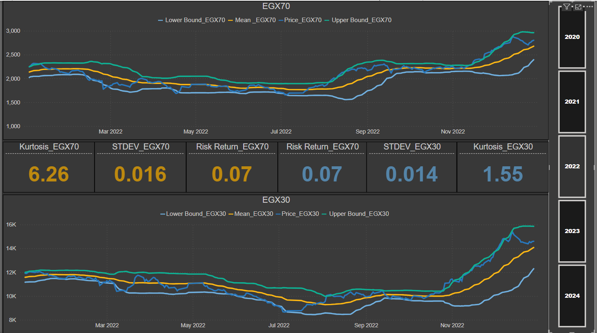

# EGX30 and EGX70 Data Analysis

This project analyzes the EGX30 and EGX70 indices from January 1, 2020, to July 18, 2024, using Excel and Power BI. The analysis includes data cleaning, statistical value creation, and advanced data visualization to provide insights into the performance of the Egyptian stock market over the specified period.

## Project Description

- **Indices Analyzed:** EGX30 and EGX70
- **Period:** January 1, 2020 - July 18, 2024
- **Data Source:** [Investing](https://www.investing.com)
- **Data Variables:** Date, Year, Open, High, Low, Volume, Change %

## Data Preparation

1. **Data Collection:**
   - Gathered data for EGX30 and EGX70 indices.

2. **Data Cleaning:**
   - Ensured data completeness and cleanliness.
   - Adjusted the format to suit the data type and organized it appropriately.

3. **Statistical Analysis:**
   - Created statistical values such as mean, standard deviation, maximum, and minimum values.

4. **Advanced Columns:**
   - Developed advanced columns for descriptive and analytical purposes, including:
     - 30-day moving averages
     - 30-day moving standard deviation
     - Upper and Lower Bounds
     - Cumulative returns

## Tools Used

- **Excel:** For initial data cleaning and analysis.
- **Power BI:** For creating interactive visualizations and presenting data visually.

## Key Insights

- **Market Fluctuations:** The charts provide a clear view of market fluctuations.
- **Confidence Bounds:** Help identify potential entry and exit points.
- **Cumulative Returns:** Give an idea of long-term trends.
## Key Metrics and Interpretations
1. **Mean (Average Daily Return)**
   - **Interpretation**: Represents the average percentage change in the index price per day.
   - **Usage**:
     - **Positive Mean**: Market generally trending upwards.
     - **Negative Mean**: Market trending downwards.

2. **Standard Deviation (Volatility)**
   - **Interpretation**: Measures the dispersion or volatility of daily returns around the mean.
   - **Usage**:
     - **Higher Volatility**: Indicates higher risk.
     - **Comparative Analysis**: Assesses changes in market volatility over different periods.

3. **Maximum and Minimum Returns**
   - **Interpretation**: Represents the extreme values of daily performance.
   - **Usage**:
     - **Identifying Outliers**: Helps in identifying days with unusually high or low returns.
     - **Risk Management**: Understanding the extremes helps in planning for worst-case scenarios.

4. **Risk/Return Ratio**
   - **Description**: Measures the relationship between expected returns and associated risks.
   - **Formula**: Average daily return / Standard deviation of returns.
   - **Interpretation**:
     - **High Ratio**: High returns relative to risk.
     - **Low Ratio**: Low returns relative to risk.

5. **Kurtosis**
   - **Description**: Describes the distribution of financial returns compared to a normal distribution.
   - **Interpretation**:
     - **Positive Kurtosis (Leptokurtic)**: Indicates frequent extreme events.
     - **Negative Kurtosis (Platykurtic)**: Indicates less frequent extreme events.
     - **Zero Kurtosis (Mesokurtic)**: Distribution close to normal.

## Visualizations and Analysis
### EGX30
- **Mean Change**: 0.08%
- **Standard Deviation**: 0.015
- **Risk/Return Ratio**: 0.05
- **Kurtosis**: 4.32
- **Maximum Change**: 0.06
- **Minimum Change**: -0.09

### EGX70
- **Mean Change**: 0.17%
- **Standard Deviation**: 0.018
- **Risk/Return Ratio**: 0.09
- **Kurtosis**: 3.59
- **Maximum Change**: 0.05
- **Minimum Change**: -0.09

## Summary
### EGX30
The EGX30 index, which tracks the performance of the top 30 companies in terms of liquidity and activity, shows moderate volatility and a positive trend over the analyzed period. The higher kurtosis value indicates the presence of more extreme returns compared to a normal distribution. Overall, the EGX30 provides a reliable indicator of the general market trend for the largest companies in Egypt.

### EGX70
The EGX70 index, representing 70 small and medium-cap companies, displays a higher mean daily return and slightly higher volatility compared to EGX30. The risk/return ratio suggests that the returns justify the associated risks. The kurtosis value is lower than EGX30, indicating fewer extreme return events. The EGX70 offers a broader view of the market, including smaller companies not captured by EGX30.
## Visualizations

